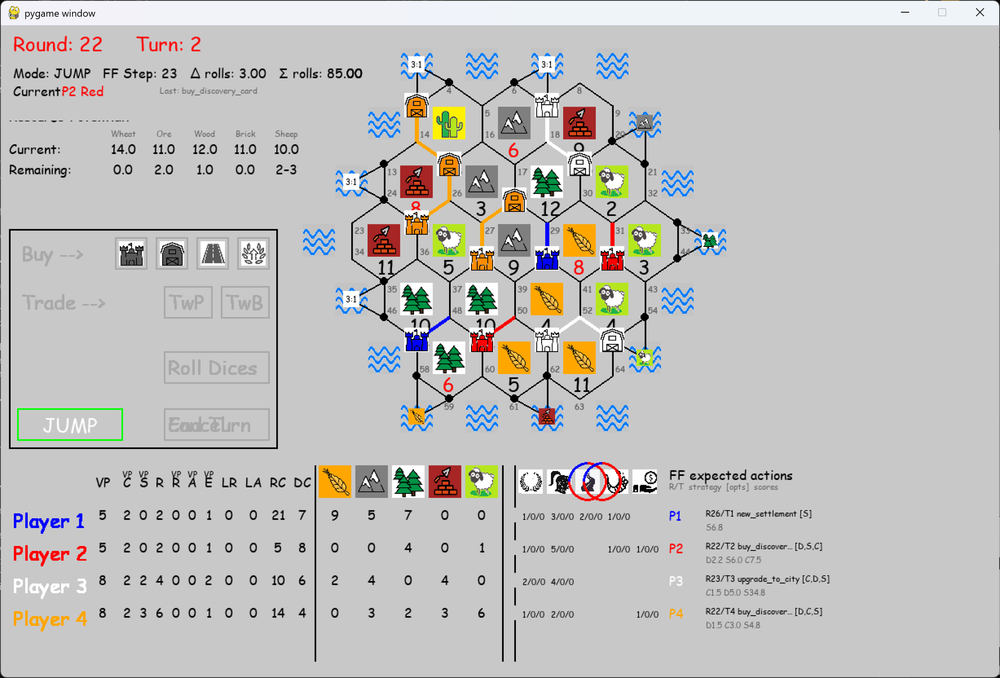

# Catan Game Project v016

Python/Pygame implementation of a **Catan-style board game**, developed as an educational AI and game-engine project.

This version is an experimental v016 branch focused on replacing Markov-based resource timing with **Expected-Hand Feasibility Estimation**. The repository still contains a substantial amount of Markov-related code, because earlier internal project milestones moved strongly in that direction. In the normal v016 execution path, however, the Expected-Hand engine is the dominant timing mechanism.

Human control is strongest during the **Initial Placement** phase. After that, v016 is not a full manual-play version: the user mainly advances the game through **PLAY** and **JUMP**, while the Expected-Hand engine estimates, ranks, and executes actions through exact legality checks.

**Technical Overview:** [Overview Experiment v016](docs/Overview_Experiment_v016.pdf)  
**Algorithm Paper:** [Paper leading to Expected-Hand Feasibility Estimation](docs/Paper%20leading%20to%20Expected-Hand%20Feasibility%20Estimation.pdf)

## Features

* Beautiful hexagonal board with 45 tiles: 19 land tiles and 26 sea tiles
* Dynamic scoreboard and action buttons
* Pulsing highlights, animations, and confirmation system
* Fully interactive **human Initial Placement** with visual guidance
* PLAY/JUMP-driven automated Execution-phase observation
* Bank and port-aware trading support in the engine
* Engine support for Build Road, Build Settlement, Upgrade City, and Buy Development Card actions
* Robber movement and steal flow
* AI-assisted strategy recommendation through **BEST NOW** / fast-forward logic
* Expected-Hand timing estimates for future actions and strategy continuation
* Modular codebase with separate game, board, GUI, timing, and strategy-evaluation modules

## Initial Placement Phase

The Initial Placement phase supports several placement approaches:

* **Max Pips** — ranks intersections by dice-production strength
* **Max Pips + Ports** — includes port access and trading potential
* **5 Weighted Strategic Strategies** — compares strategic profiles such as balanced production, Wood/Brick expansion, Wheat/Ore development, and monopoly-style resource pressure
* **Markov-style evaluator** — retained as an advanced/experimental evaluator, mainly for comparison and historical continuity

The current preferred Initial Placement logic remains the explainable strategic approach: compare candidate intersections across several strategy profiles and recommend strong average choices rather than relying on one narrow heuristic.

Initial Placement is especially important in v016 because it creates the first production profile. After placement, the Expected-Hand engine uses the resulting current hand, production pips, and port access to estimate future actions.

## Execution Phase

After Initial Placement, v016 is not a full manual-play version. The human player no longer chooses freely between all possible Execution-phase actions.

Instead, the user mainly advances the game through **PLAY** and **JUMP**:

* **JUMP** fast-forwards to the next predicted useful event or action timing.
* **PLAY** advances the game step by step and executes only when the real game state passes exact legality and affordability checks.

This makes v016 an **Initial Placement and AI-strategy evaluation version**. The user chooses the starting position, then observes how well that position performs when the Expected-Hand engine continues the game.

During automated continuation, the engine can handle actions such as:

* bank/port trades
* road builds
* settlement builds
* city upgrades
* development-card purchases
* robber movement and steal flow
* wait or pass decisions when no useful action is currently available

The v016 Execution phase is where the project moved most strongly toward Expected-Hand feasibility.

## Expected-Hand Feasibility Estimation

Expected-Hand feasibility estimates how many future own turns are needed before a player can afford an action.

At a high level, it asks:

```text
current hand
+ expected future production
+ possible bank/port trades
- action cost
= payable or not payable
```

For example, if a player has strong Ore and Wheat production, the estimator can predict how soon a city upgrade may become affordable. If a player lacks Brick but has a useful port or enough surplus of another resource, the estimator can include bank/port trading in the estimate.

The main implementation is in:

```text
core/resource_time_estimator.py
```

It works in the project resource order:

```text
[Wheat, Ore, Wood, Brick, Wool]
```

In GUI text and documentation, Wool may also be described as Sheep, matching common Catan terminology.

Typical outputs include:

* estimated turns until affordable
* expected hand at that time
* required resources
* trade rates
* whether the action is directly payable or payable after trades
* confidence information
* an explanation object for debugging

## Markov Code in v016

v016 still contains a lot of Markov-related code. This is intentional.

Earlier internal project milestones moved through the following path:

| Version | Main direction |
| --- | --- |
| v014 (internal) | Improved Markov algorithm with a lightweight Adaptive Expanded Evaluator |
| v015 (internal) | Hybrid experiment: Expected-Hand feasibility added beside Markov |
| v016 (public GitHub) | Expected-Hand feasibility becomes dominant; Markov code is mostly retained for comparison, compatibility, and historical continuity |

v014 and v015 are **internal project milestones**, not separately shared public GitHub releases. The public v016 repository carries forward important components from those stages.

In other words: **do not read the amount of Markov code as meaning Markov is the main active engine in v016**.

The normal v016 direction is:

```text
Expected-Hand estimator
→ strategy / action ranking
→ exact PLAY guard
→ execute only if the real game state allows it
```

The exact PLAY guard remains important. Expected-Hand is a prediction method based on averages and confidence. PLAY still checks the real hand, legal board state, and actual affordability before executing an action.

## Strategy and Victory-Path Evaluation

The repository includes a 142-way resource-requirements file:

```text
catan_142_ways_resource_requirements.csv
```

This file supports strategy timing and victory-path evaluation. The goal is not only to ask:

```text
What can I build soon?
```

but also:

```text
Which action helps me move faster toward a useful victory path?
```

This makes the recommendation logic more strategic than a simple “build the first affordable thing” approach.

## Fast-Forward / BEST NOW Logic

The fast-forward and recommendation logic evaluates possible future actions and tries to identify promising next moves. Candidate actions may include:

* next settlement
* new settlement requiring one or more roads
* city upgrade
* development card purchase

The Expected-Hand engine estimates timing, while strategy-ranking logic evaluates whether the action improves the player’s longer-term position.

## Project Structure

```text
catan_game_v016_vscode/
├── assets/
├── core/
│   ├── action_evaluator.py
│   ├── algorithms_initial_placement.py
│   ├── board.py
│   ├── constants.py
│   ├── fast_forward.py
│   ├── game.py
│   ├── initial_placement.py
│   ├── markov_evaluator.py
│   ├── player.py
│   ├── player_outlook.py
│   ├── resource_time_estimator.py
│   └── victory_path_evaluator.py
├── gui/
├── main.py
├── PlayBoard 08_Apr_2026_13_33_06.txt
└── catan_142_ways_resource_requirements.csv
```

## Prerequisites

* Python 3.10 or higher
* Pygame

The current development environment used Python 3.13 and Pygame 2.6.1.

## Installation

```bash
# Clone the repository
git clone https://github.com/avtnl/catan_game_v016_vscode.git
cd catan_game_v016_vscode

# Recommended: create a virtual environment
python -m venv venv

# Activate the virtual environment
# Windows:
venv\Scripts\activate

# macOS/Linux:
source venv/bin/activate

# Install dependencies
pip install pygame
```

## Getting Started

```bash
python main.py
```

## Development Status

This is an experimental educational project. v016 should be understood as a research/development version of the engine, not as a final polished Catan product.

The most important technical direction in v016 is the move from Markov-heavy timing prediction toward Expected-Hand feasibility:

* faster to run
* easier to explain
* easier to debug
* easier to combine with action and victory-path ranking
* still protected by exact legality checks before execution

## Known Limitations

* After Initial Placement, v016 does not provide full manual human Execution-phase decision-making. The user mainly observes automated continuation through PLAY and JUMP.
* Expected-Hand estimates are based on averages, so they are not the same as exact probability distributions.
* Markov code is still present, which can make the codebase look more Markov-driven than the active v016 behavior really is.
* v014 and v015 are internal milestone labels, not separate public GitHub releases.
* The game is an educational AI/game-engine project and not an official Catan implementation.
* Some modules are experimental and may contain comparison logic, debug paths, or older naming conventions.

## Prior Work and Acknowledgements

The technical direction of the project was influenced by:

* Lauren Nagel’s work on applying Markov-chain reasoning to Catan resource states and starting-position evaluation
* PlayerOne’s Board Game Analysis series on the many possible ways to win at Catan
* OpenAI’s ChatGPT, used as a writing and coding assistant during development discussions

All implementation choices, project direction, testing, and final repository content remain the responsibility of the author.

## License

This project is licensed under the MIT License. See the `LICENSE` file for details.
